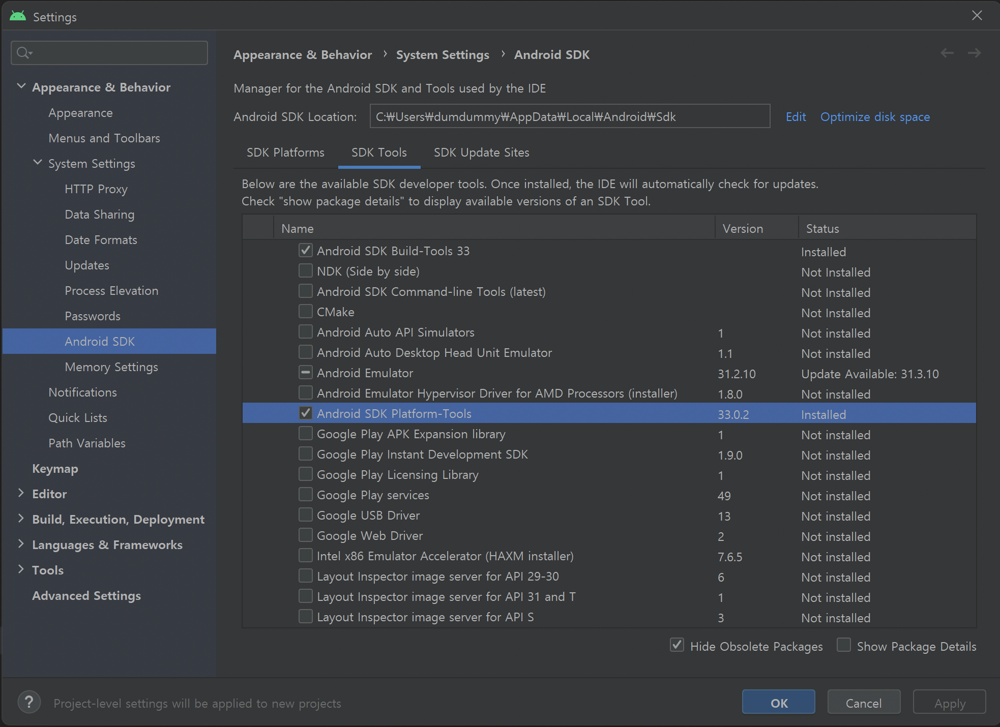

# 개발 환경 요구 사양 확인하기

개발 환경에 사용하려는 Mac 하드웨어는 Apple Silicon (M1) 이상의 프로세서를 탑재한 최신 Mac 하드웨어인지 확인합니다.

Intel 프로세서를 탑재한 Mac 하드웨어의 경우 기능 제약이나 OS 지원 중단으로 예기치 않은 문제가 발생할 수 있습니다.

## 사전 준비

macOS에서 Jamkit 앱 개발을 진행하려면 여러 종속 구성 요소들을 설치해야 합니다.

### Homebrew 설치하기

macOS에서 다양한 개발 환경을 손쉽게 구축하고 빠르게 설정하기 위해서는 Homebrew 패키지 관리자를 사용하는 것이 좋습니다.

1. **터미널 앱**을 실행한 후, 다음 명령어를 실행합니다.

    ```zsh
    /bin/bash -c "$(curl -fsSL https://raw.githubusercontent.com/Homebrew/install/HEAD/install.sh)"
    ```

1. 터미널에 표시되는 지시 사항을 따라 설치를 진행합니다.

### Xcode 빌드 도구 라이선스 동의

다음의 명령어를 실행하여 Xcode 빌드 도구를 사용하는 것에 명시적으로 동의를 진행합니다.

```zsh
sudo xcodebuild -license
```

## 종속 구성 요소 설치하기

macOS에서 Jamkit 앱 개발을 진행하려면 여러 종속 구성 요소들을 설치해야 합니다.

### Xcode 앱 설치하기 (빌드 도구 및 macOS SDK 포함)

macOS, iOS, iPadOS 등 Apple 운영 체제에서 실행되는 앱을 개발하고 테스트하기 위해 필요한 모든 도구와 SDK는 Xcode 앱과 함께 묶어서 배포됩니다.

1. [App Store](https://apps.apple.com/kr/app/xcode/id497799835)에서 최신 버전의 Xcode 앱을 설치하거나 새 버전의 Xcode 앱으로 업그레이드를 진행합니다.

1. Xcode 앱 설치가 완료되기까지 시간이 오래 걸릴 수 있습니다. Xcode 앱 설치가 완료되기까지 온라인 상태를 유지해야 합니다.

### Python과 Node.js 설치하기

1. **터미널 앱**을 엽니다.

1. Python을 설치하기 위해 다음 명령어를 실행합니다. 여기서는 3.10 버전을 설치하겠습니다.

    ```zsh
    brew install python@3.10
    ```

1. Node.js LTS 버전을 설치하기 위해 다음 명령어를 실행합니다. 여기서는 20 버전을 설치하겠습니다.

    ```zsh
    brew install node@20
    ```

### Android 플랫폼 도구 설치하기

Android 디바이스용 앱을 만들려면, 이 과정도 같이 진행해주세요.

1. [Android Studio 홈페이지](https://developer.android.com/studio?hl=ko)에서 OS에 맞는 Android Studio 최신 버전을 설치합니다.

1. Android Studio 설치를 마치고 실행한 다음, `Tools` - `SDK Manager` - `SDK Tools` 메뉴로 이동하여 **Android SDK Platform - Tools**를 설치합니다.
   

1. 터미널을 열고, `echo $SHELL` 명령어를 실행하여 지금 어떤 셸을 실행하고 있는지 확인합니다. 대개 zsh인 경우가 많습니다. 만약 zsh나 bash 셸이 아닌 다른 셸인 경우, 해당 셸의 환경 변수 설정 방법을 참고하여 `PATH` 환경 변수를 편집할 수 있는 단계로 진입합니다.

1. zsh 셸인 경우 `vi ~/.zshrc` 명령어를 입력하고, bash 셸인 경우 `vi ~/.bash_profile` 명령어를 입력합니다.

1. `a` 키를 눌러 삽입 모드로 진입합니다.

1. 제일 아랫줄로 이동하여 `export PATH=$PATH:{SDK경로}/platform-tools/` 내용을 입력합니다. 이 때, `{SDK 경로}` 부분은 Android Studio에서 **Android Studio** - **Tools** - **SDK Manager** - **Android SDK Location**에서 확인할 수 있습니다. 대개 `/Users/{사용자명}/Library/Android/sdk`인 경우가 많습니다.

1. ESC키를 눌러 삽입 모드를 종료하고, `:wq` 입력 후 Enter 키를 누르면 파일 내용이 저장됨과 동시에 vi 편집기가 종료됩니다.

1. 터미널 창을 종료한 후 다시 실행합니다.

## Jamkit 설치하기

### Jamkit CLI 설치하기

1. **Windows 터미널 앱**을 엽니다.

1. 아래의 명령어를 실행하여 Jamkit 명령줄 인터페이스 도구를 설치합니다.

    ```zsh
    sudo npm install -g jamkit
    ```

1. 설치가 잘 되었는지 확인하기 위하여, 아래 명령어를 실행해 봅니다. 사용 가능한 옵션과 스위치 목록이 나타나면 잘 설치된 것입니다.

    ```powershell
    jamkit -h
    ```

### Visual Studio Code 설치하고 구성하기

Jamkit은 기본적으로 Visual Studio Code를 이용하여 앱을 개발합니다.

1. [Visual Studio Code 홈페이지](https://code.visualstudio.com/download)에서 OS에 맞는 Visual Studio Code 최신 버전을 설치합니다.
1. Jamkit Syntax Highlight 플러그인을 다운로드합니다.
   [VSIX 파일 다운로드하기](https://github.com/bookjam/jamkit-developer-guide/raw/gitbook/vscode-jamkit-0.2.1.vsix)
1. Visual Studio Code 실행 후, **확장** - *...* - **VSIX에서 설치**를 눌러 다운로드한 VSIX 파일을 열어 설치를 진행합니다.
1. 만약 Visual Studio Code 다시 로드 버튼이 표시되면, 다시 로드 버튼을 눌러 프로그램을 다시 실행합니다.
