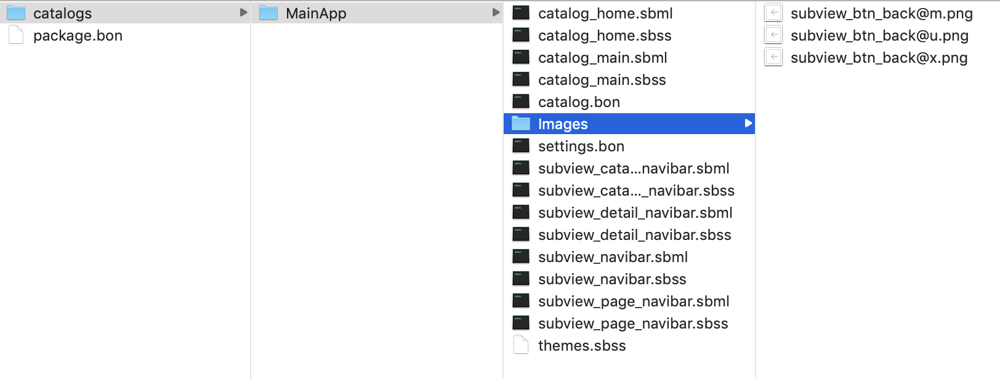

# Jamkit 카탈로그 구성

### Jamkit 카탈로그 구성

`jamkit create` 명령어로 카탈로그를 만들면, 다음과 같이 폴더 구조가 만들어집니다.

\<To Do: Jamkit 카탈로그 디렉터리 로드맵 이미지 추가 필요>

모든 리소스는 카탈로그 폴더에 위치합니다

* 카탈로그는 여러 개로 구성할 수 있으며, 그중 MainApp 카탈로그는 필수입니다.
* 이미지는 Images, 동영상은 Videos, 오디오는 Audios 폴더에 위치하는 등, 각 리소스 타입별로 폴더 위치가 결정되어 있습니다.
* Android에서는 assets/catalogs 폴더 안에, iOS에서는 Catalogs.bundle 폴더 안에 카탈로그가 들어가야 합니다.
