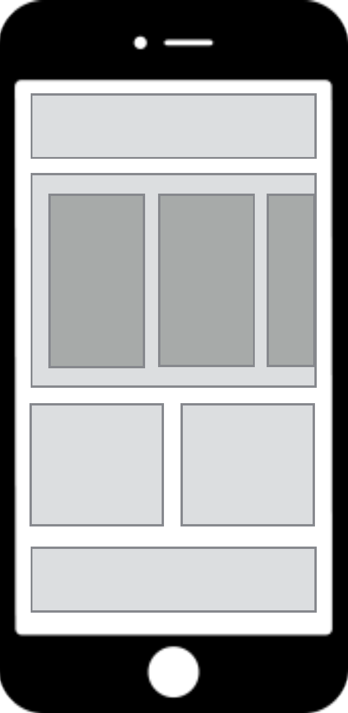

# Jamkit 앱의 구조

### Jamkit의 기본 사상

Jamkit은 앱을 카탈로그 책이라는 개념으로 다룹니다. 카탈로그 책의 목적은 콘텐츠와 데이터 (상품)를 사용자에게 효율적으로 전달하는 것입니다.

### Jamkit 앱의 구성

Jamkit 앱은 독립적인 컴포넌트를 조합하여 구성됩니다.

<figure><figcaption></figcaption></figure>

* 컴포넌트는 레이아웃의 기본 구성 요소입니다.
* 컴포넌트는 데이터와 화면 (뷰), 스크립트, 그리고 독립된 컨텍스트로 구성됩니다.
* [MVVM (Model-View-ViewModel)](https://ko.wikipedia.org/wiki/%EB%AA%A8%EB%8D%B8-%EB%B7%B0-%EB%B7%B0%EB%AA%A8%EB%8D%B8) 패턴을 사용하여 화면과 데이터를 연결합니다.
* 컨텍스트 간에 데이터를 교환하는 작업은 마샬링이라고 부릅니다.

### 멀티 컨텍스트 스크립트 엔진

컴포넌트의 스크립트 컨텍스트는 독립적입니다

* 각 컴포넌트는 자신만의 스크립트 컨텍스트를 가지고 있습니다.
* 스크립트의 컨텍스트가 모두 독립적이기 때문에 모듈별 개발이 용이합니다.
* SBML/SBSS 역시 독립적인 네임 스페이스를 가지고 있습니다.
