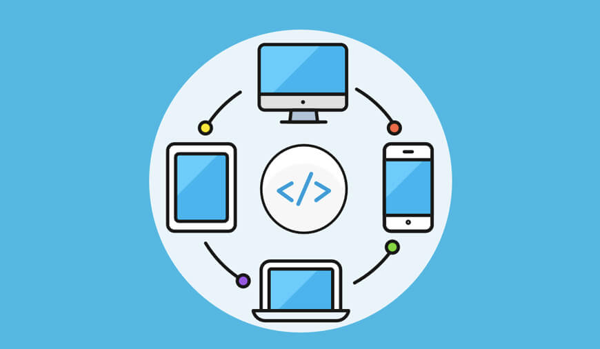

# Jamkit이란?

### Jamkit에 대하여

Jamkit은 한 번의 코드 작성으로 웹 뷰에 의존하지 않는 스마트폰, 태블릿, 데스크톱 네이티브 앱을 빠르고 쉽게 만들 수 있도록 돕는 크로스 플랫폼 프레임워크입니다.

### Jamkit의 장점

Jamkit을 이용하여 모바일 앱을 개발하면 다음과 같은 장점을 누릴 수 있습니다.

* 모듈라 UI 컴포넌트를 제공하므로 유지 관리하기 쉬운 코드를 만들 수 있습니다. 이를 통해 직관적인 레이아웃을 구현할 수 있도록 돕습니다.
* 미리 개발된 다양한 기능을 제공하여 기능 개발 시간을 단축할 수 있도록 돕습니다.
* 다중 스레드 실행을 지원하므로 응답 속도가 빠른 애플리케이션을 구현할 수 있습니다.
* 코드를 컴파일하는 과정이 없으므로, 애플리케이션 수정 사항을 즉시 살펴볼 수 있는 라이브 리로딩 기능을 기본으로 제공합니다.

### Jamkit을 사용하는 이유

성능적인 측면에서 Jamkit을 사용하면 다음의 장점이 있습니다.

* Jamkit은 Android, iOS용 네이티브 앱을 동일한 코드를 사용하여 만들 수 있습니다. 따라서 많은 수의 사용자들에게 앱을 목표한 시점에 동시에 안정적으로 제공할 수 있습니다.
* Jamkit은 네이티브 기반 프레임워크이며, 기본적인 사용자 인터페이스를 구현하기 위해 웹뷰를 사용하지 않습니다.
* 네이티브 방식으로 작동함에도 Jamkit을 이용하면, 이미 배포된 앱이라도 동적으로 코드를 수정하고 배포할 수 있는 라이브 푸시/풀 기능을 제공하므로 복잡한 비즈니스 요구 사항을 달성할 수 있습니다.

### Jamkit으로 할 수 있는 일

Jamkit을 이용하면 빠르게 사용자 인터페이스와 비즈니스 로직을 구현할 수 있기 때문에, 인기있는 모바일 애플리케이션이 제공하는 기능을 빠른 시간 안에 개발하여 앱을 이용해 달성하려는 비즈니스 목표를 더욱 빠르게 달성할 수 있도록 돕습니다.

예를 들어, 인기 아이돌 가수의 콘서트 실황 영상을 팬들이 쉽게 촬영할 수 있도록 도와주는 직캠 모바일 앱을 Jamkit을 이용하면 다음의 이점을 누릴 수 있습니다.

\<To Do: 실제 애플리케이션 스크린 샷 추가>

* 사용자 인터페이스 개발까지 약 2주 내외의 기간이면 손쉽게 기본적인 사용자 인터페이스를 만들 수 있습니다.
* 직캠 앱의 비즈니스 로직을 포함한 전체적인 앱의 프로토타입 제작과 출시는 약 4주 내외의 기간이면 완료할 수 있습니다.

\<To Do: 코드 스캐폴딩 기능으로 잼킷 코드를 특정 애플리케이션 코드로 변환하여 더 확장하여 개발할 수 있음을 설명>
