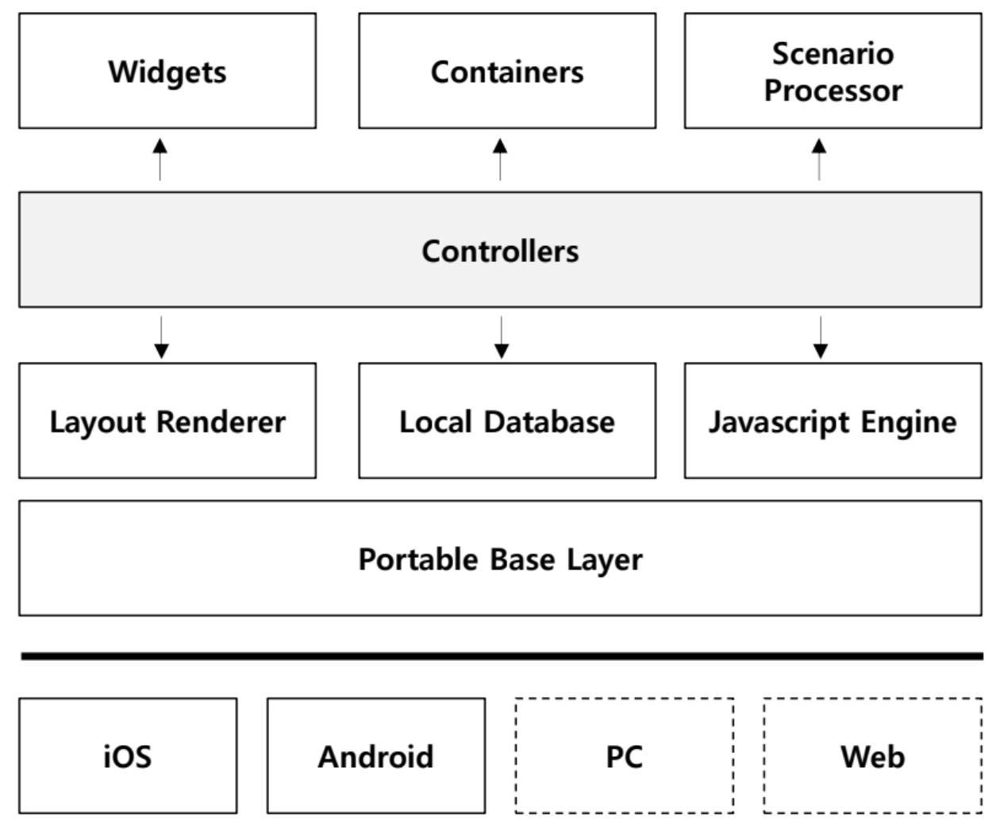

# Jamkit 런타임 아키텍처

### Jamkit 런타임 아키텍처

Jamkit 시스템은 컨트롤러를 중심으로 위젯, 컨테이너, 시나리오 프로세서, 레이아웃 렌더러, 로컬 데이터베이스, 그리고 자바스크립트 엔진이 함께 연동되어 앱을 실행하도록 구성됩니다.

&lt;To Do: 각 구성 요소 별 설명 추가 필요&gt;

* 컨트롤러: ...
* 위젯: ...
* 시나리오 프로세서: ...
* 레이아웃 렌더러: ...
* 로컬 데이터베이스: ...
* 자바스크립트 엔진: ...
* 포터블 베이스 레이어: ...

&lt;To Do: Jamkit 앱이 런타임 내 구성 요소들과 어떻게 상호 작용하는지 구체적인 설명 필요&gt;
