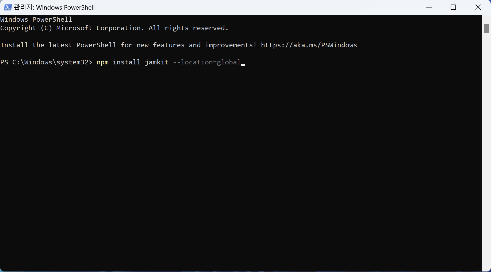
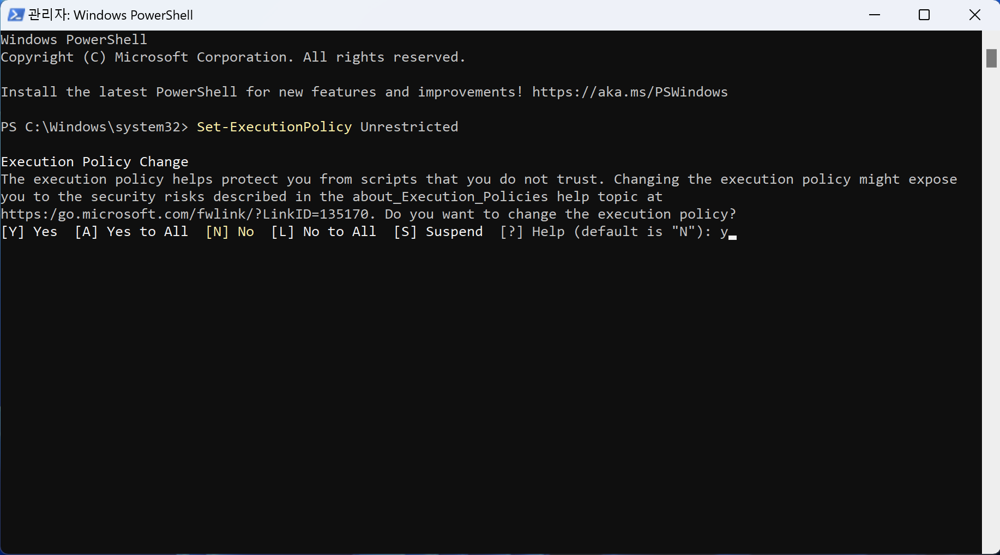

# Jamkit 필수 구성 요소 설치

Jamkit을 사용하기 위해서는 몇 가지 개발도구를 설치해야 합니다.

### 필수 구성 요소 설치하기

Jamkit CLI를 사용하기 위해 필요한 구성 요소들을 설치합니다.

#### Node.js

#### 아래의 다운로드 페이지에서 OS에 맞는 Node.js 최신 LTS 버전을 설치합니다.




#### Python

#### 아래의 다운로드 페이지에서 OS에 맞는 Python 최신 버전을 설치합니다.




#### Widnows 경우 설치화면에서 "Add Python 3.10 to PATH" 옵션에 체크하고 "Install Now"를 클릭합니다.


**설치경로의 사용자명이 한글일 경우, 다른 경로(ex. C드라이브)에 설치하세요.**

* C:₩Python310



#### (Windows만 해당) Windows SDK 및 Visual C++ 컴파일러

#### 아래의 다운로드 페이지에서 Visual Studio 빌드 도구 최신 버전을 설치합니다.




#### 설치화면에서 "C++을 사용한 데스크톱 개발" 옵션에 체크하고 "Install"을 클릭합니다.


#### 검색창에서 "Windows Powershell"을 검색하여 "관리자로 실행"합니다.


#### Windows PowerShell에서 아래의 명령어를 실행하여 Visual Studio 빌드 도구 환경설정을 완료합니다.

```
npm config set msvs_version 2022 -g
```


### Jamkit CLI 설치하기

#### PowerShell(Window)이나 터미널(macOS)에서 아래의 명령어를 실행하여 Jamkit을 설치합니다.

```
[Windows]
npm install -g jamkit

[macOS] 관리자 권한으로 실행
sudo npm install -g jamkit
```



#### (Windows만 해당) PowerShell에서 아래의 명령어를 실행하여 실행규칙을 변경합니다.

```
Set-ExecutionPolicy Unrestricted
```




**설치 중 에러 발생 시, 대처방법**

* gyp 에러 시, Python 경로 설정
  * Windows: npm config set python C:\Python310\python.exe
  * macOS: npm config set python /usr/bin/python3
*   xcode license 에러 시, license 동의

    * macOS: sudo xcodebuild -license

    


