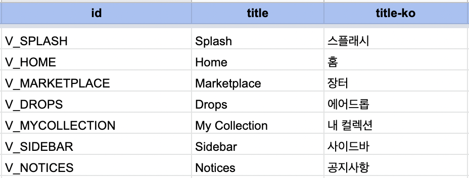
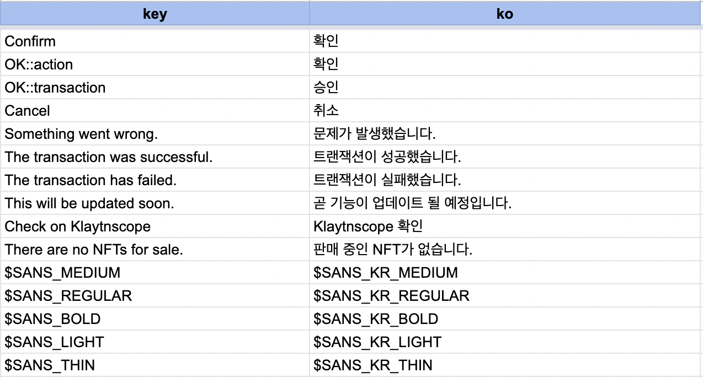
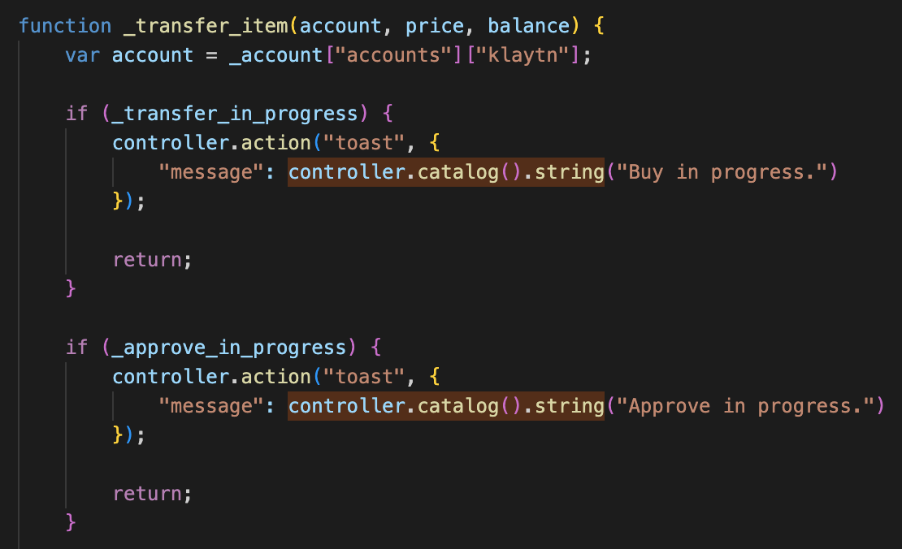
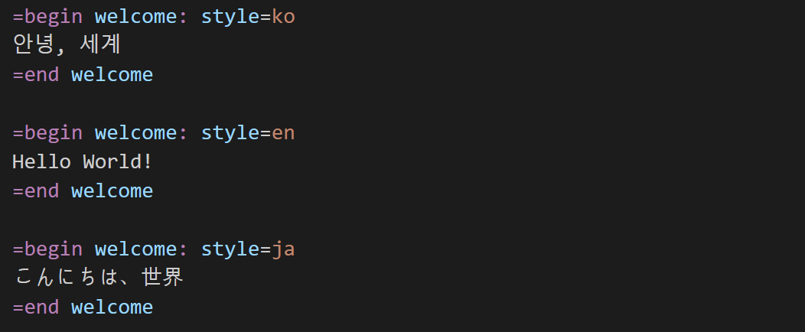
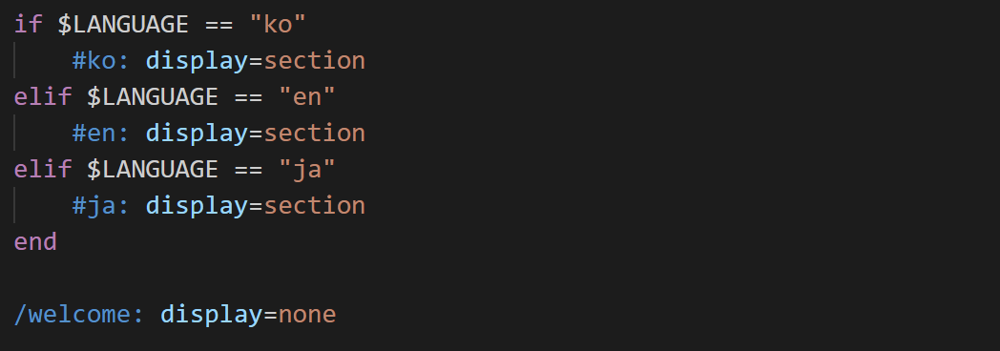

# 다국어 처리

### 기본

* 잼킷의 표시 언어는 기기의 언어 설정을 따라감

### 방법 1 - 카탈로그

* 다국어 항목을 환경변수로 입력: @{key}
* 카탈로그 문서 엑셀 각 시트에 정리: key-언어코드
* jamkit database generate를 통해 sqlite 형태로 사용

### 방법 2 - strings

* 다국어 항목을 환경변수로 입력: @{key}
* 카탈로그 문서 엑셀 'strings' 시에 정리: key, 언어코드
* 동일한 key에 대해 서로 다른 값을 부여할 경우 key에 ::을 붙여서 구분

### 방법 3 - js

* 다국어 항목을 JS 파일에서 다음 코드로 처리: controller.catalog().string("key")
* 처리 방법 2와 마찬가지로 카탈로그 문서 엑셀 'strings' 시에 정리

### 방법 4 - 분기 처리

* 다국어 항목을 각 언어별로 섹션 처리
* sbss에서 분기 처리

