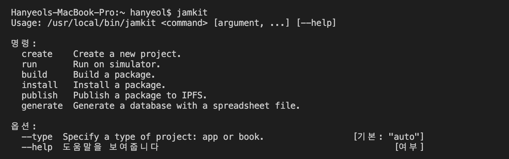

# Jamkit 명령어 도구

### Jamkit CLI

Jamkit은 커맨드라인 도구를 제공합니다



`jamkit` 명령으로 앱 생성/실행/빌드/설치/배포 등의 작업을 수행할 수 있습니다.

### Create

create는 프로젝트를 생성하는 명령어입니다.

#### 기본 명령어

```
jamkit create {프로젝트명}
// HelloWorld 템플릿이 생성
```

#### 옵션

\--template: 다른 템플릿으로 앱을 생성하려는 경우

```
jamkit create --template=XXX
```

### Run

run은 기기나 에뮬레이터에서 앱을 실행하는 명령어입니다.

#### 기본 명령어

```
jamkit run
```

#### 옵션

\--platform=android: macOS에서 실행할 경우

```
jamkit run --platform=android
```

\--skip-sync: 파일을 기기나 에뮬레이터로 복사하지 않고 바로 실행

```
jamkit run --skip-sync
```

\--mode=jam: 슈퍼앱이 실행 중인 상태에 미니앱 실행

```
jamkit run --mode=jam
```

### Build

build는 앱 패키지를 생성하는 명령어입니다.

#### 기본 명령어

```
jamkit build
```

#### 옵션

```
```

### Install

install은 앱 패키지를 기기에 설치하는 명령어입니다.

#### 기본 명령

```
jamkit install
```

#### 옵션

```
```

### Publish

publish는 앱 패키지를 IPFS에 업로드하여 공유할 수 있게 해주는 명령어입니다.

#### 기본 명령어

```
jamkit publish
```

#### 옵션

```
```

### Generate

generate는 MS 엑셀 파일에서 데이터베이스를 생성하는 명령어입니다.

#### 기본 명령어

```
jamkit generate {엑셀 파일명}
```

#### 옵션

```
```
