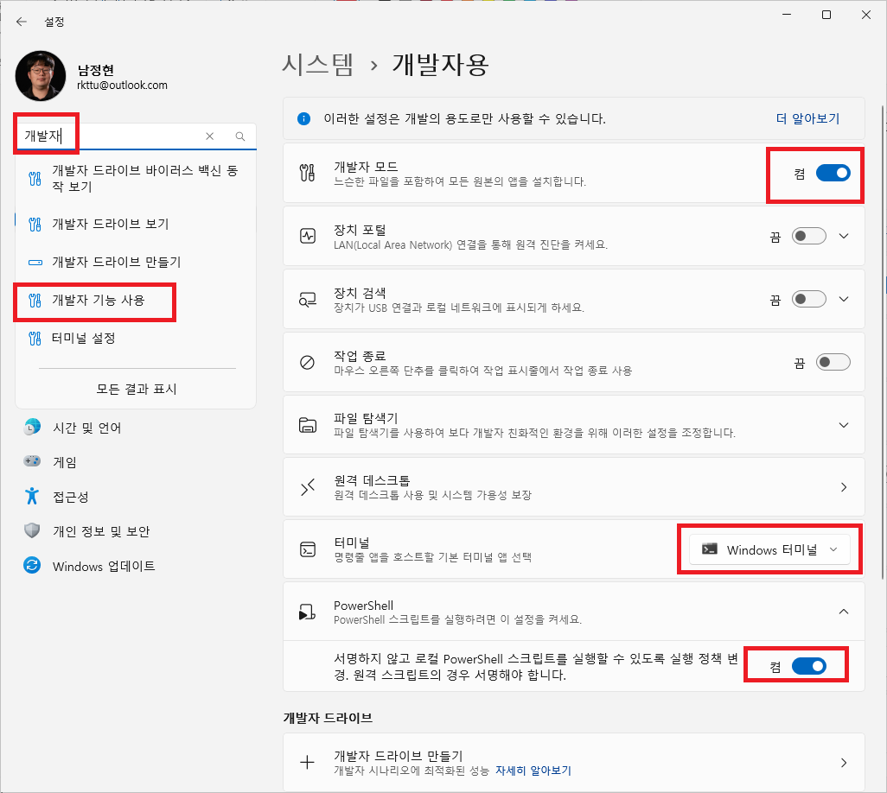

# 개발 환경 요구 사양 확인하기

개발 환경에 사용하려는 PC가 다음의 요구 사양을 충족하는지 먼저 확인해야 합니다.

* 인텔, AMD 등 64비트 코드를 실행할 수 있는 최신 프로세서를 탑재한 노트북 또는 데스크톱
* Windows 10 Pro 22H2 이상 또는 Windows 11 Pro 23H2 이상의 운영 체제
* 최소 8GiB 이상의 메모리와 16GiB 이상의 여유 공간이 확보된 SSD (하드 디스크는 권장하지 않음)
* 블루투스 5.0, USB 3.0, Wi-Fi 2.4GHz 이상의 유선 및 무선 네트워크 프로토콜 지원 필요

## 사전 준비

### Windows 터미널 앱 설치하기

Windows 터미널 앱은 개발자 환경에서 많이 쓰이는 복잡한 터미널 인터페이스를 완벽하게 지원하고, 고급 기능을 제공하면서도 빠른 응답 속도를 보장하는 최신 터미널 앱입니다.

[Microsoft Store의 Windows 터미널 앱](https://apps.microsoft.com/detail/9N0DX20HK701?hl=ko-kr&gl=kr) 페이지에서 최신 버전의 Windows Terminal을 설치하거나, 새 버전의 Windows Terminal로 업그레이드를 진행합니다.

### Windows 패키지 관리자 앱 설치하기

Windows에서 다양한 개발 환경을 손쉽게 구축하고 빠르게 설정하기 위해서는 Windows 패키지 관리자를 사용하는 것이 좋습니다.

[Microsoft Store의 앱 설치 관리자](https://apps.microsoft.com/detail/9NBLGGH4NNS1?rtc=1&hl=ko-kr&gl=KR) 페이지에서 최신 버전의 Windows 패키지 관리자 앱을 설치하거나, 새 버전의 Windows 패키지 관리자 앱으로 업그레이드를 진행합니다.

### 개발자 모드 켜기

Windows는 보안 상의 이유로 기본적으로 개발자 도구나 개발 관련 설정을 사용할 수 없도록 보안 정책을 강화하여 적용하고 있습니다. 원활한 개발 환경 설치를 진행하려면, 개발자 모드를 켜도록 설정하는 것이 좋습니다.

1. **설정** 앱을 엽니다. (**제어판**이 아닙니다.)
1. 기능 검색 입력란에서 **개발자**를 검색어로 입력한 후, **개발자 기능 사용** 항목을 선택합니다.
1. **개발자 모드** 항목의 스위치를 켭니다.
1. **터미널**은 **Windows 터미널** 항목을 선택합니다. 만약 항목이 보이지 않을 경우, [Microsoft Store의 Windows 터미널 페이지]()에서 앱을 새로 설치할 수 있습니다.
1. **PowerShell** 항목에서 **서명하지 않고 로컬 PowerShell 스크립트를 실행할 수 있도록 실행 정책 변경** 항목의 스위치를 켭니다.

모든 옵션을 조정했다면 아래 그림과 같은 상태로 화면이 나타날 것입니다.



## 종속 구성 요소 설치하기

Windows에서 Jamkit 앱 개발을 진행하려면 여러 종속 구성 요소들을 설치해야 합니다.

### Windows SDK와 Visual Studio 빌드 도구

Node.js의 일부 모듈은 스크립트 코드 외에도 C/C++ 코드로 작성된 모듈이 있어, 이러한 모듈을 사용하기 위해서는 별도의 C/C++ 컴파일러가 시스템에 설치되어 있어야 합니다.

1. **Windows 터미널 앱**을 엽니다.

1. Visual Studio 빌드 도구 설치를 위해 다음 명령어를 실행합니다.

    ```powershell
    winget install Microsoft.VisualStudio.2022.BuildTools
    ```

1. Windows용 애플리케이션 빌드를 위해 필요한 헤더, 라이브러리는 Windows SDK에서 찾을 수 있습니다. Windows SDK를 설치하려면 다음 명령어를 실행합니다.

    ```powershell
    winget install --exact --id Microsoft.WindowsSDK.10.0.19041
    ```

### Python과 Node.js 설치하기

1. **Windows 터미널 앱**을 엽니다.

1. Python을 설치하기 위해 다음 명령어를 실행합니다. 여기서는 3.10 버전을 설치하겠습니다.

    ```powershell
    winget install --id Python.Python.3.10
    ```

1. Node.js LTS 버전을 설치하기 위해 다음 명령어를 실행합니다.

    ```powershell
    winget install OpenJS.NodeJS
    ```

### Node.js 구성하기

1. **Windows 터미널 앱**을 엽니다.

1. Visual Studio 빌드 도구를 Node.js와 연결해야 합니다. 검색창에서 "Windows Powershell"을 검색한 후, 마우스 오른쪽 버튼으로 클릭하여 나타나는 메뉴에서 "관리자로 실행" 메뉴를 선택합니다.

1. 아래의 명령어를 실행하여 Visual Studio 빌드 도구와 Node.js를 연결합니다.

    ```powershell
    npm config set msvs_version 2022 -g
    ```

1. 앞 단계에서 설치했던 Python의 설치 경로를 확인하기 위해 아래 명령어를 실행합니다. 여러 줄이 나타나면, 가장 위에 있는 줄의 내용을 사용하면 됩니다.

    ```powershell
    powershell.exe "(Get-Command python).Source"
    ```

1. 나타나는 경로를 확인하여 아래의 `python.exe 경로` 부분을 치환하여 아래 명령어를 실행합니다.

    ```powershell
    npm config set python "python.exe 경로"
    ```

### Android 플랫폼 도구 설치하기

Android 디바이스용 앱을 만들려면, 이 과정도 같이 진행해주세요.

1. [Android Studio 홈페이지](https://developer.android.com/studio?hl=ko)에서 OS에 맞는 Android Studio 최신 버전을 설치합니다.

1. Android Studio 설치를 마치고 실행한 다음, `Tools` - `SDK Manager` - `SDK Tools` 메뉴로 이동하여 **Android SDK Platform - Tools**를 설치합니다.
   

1. "내 컴퓨터" 창을 열고, 빈 공간에서 마우스 오른쪽 버튼을 클릭합니다.

1. `속성` - `고급 시스템 설정` - `환경 변수` - 상단의 `사용자 변수` 항목을 찾습니다.

1. `PATH` 항목을 찾아 선택한 후, **편집** 버튼을 클릭합니다.

1. 새로운 환경 변수 항목을 만들고, `%localappdata%\Android\Sdk\Platform-tools` 항목을 입력한 후 저장합니다.

1. 만약 목록 형태가 아닌 한 줄로 표시되는 창이 나타날 경우, 이렇게 추가할 수 있습니다.

    1. 값 부분의 제일 마지막 글자를 봅니다.
    1. 제일 마지막 글자가 세미콜론으로 끝나지 않으면 세미콜론 `;` 문자를 하나 넣습니다.
    1. 그 다음, `%localappdata%\Android\Sdk\Platform-tools`를 입력하고 저장합니다.

## Jamkit 설치하기

### Jamkit CLI 설치하기

1. **Windows 터미널 앱**을 엽니다.

1. 아래의 명령어를 실행하여 Jamkit 명령줄 인터페이스 도구를 설치합니다.

    ```powershell
    npm install -g jamkit
    ```

1. 설치가 잘 되었는지 확인하기 위하여, 아래 명령어를 실행해 봅니다. 사용 가능한 옵션과 스위치 목록이 나타나면 잘 설치된 것입니다.

    ```powershell
    jamkit -h
    ```

### Visual Studio Code 설치하고 구성하기

Jamkit은 기본적으로 Visual Studio Code를 이용하여 앱을 개발합니다.

1. [Visual Studio Code 홈페이지](https://code.visualstudio.com/download)에서 OS에 맞는 Visual Studio Code 최신 버전을 설치합니다.
1. Jamkit Syntax Highlight 플러그인을 다운로드합니다.
   [VSIX 파일 다운로드하기](https://github.com/bookjam/jamkit-developer-guide/raw/gitbook/vscode-jamkit-0.2.1.vsix)
1. Visual Studio Code 실행 후, **확장** - *...* - **VSIX에서 설치**를 눌러 다운로드한 VSIX 파일을 열어 설치를 진행합니다.
1. 만약 Visual Studio Code 다시 로드 버튼이 표시되면, 다시 로드 버튼을 눌러 프로그램을 다시 실행합니다.
