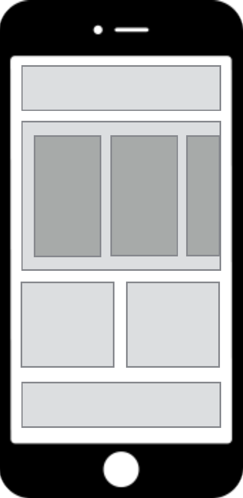
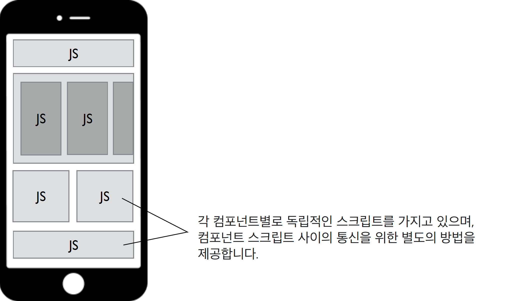

# Jamkit 앱의 구조

## Jamkit의 기본 사상

Jamkit은 앱을 카탈로그 책이라는 개념으로 다룹니다. 카탈로그 책의 목적은 콘텐츠와 데이터 (상품)를 사용자에게 효율적으로 전달하는 것입니다.

## Jamkit 앱의 구성

Jamkit 앱은 독립적인 컴포넌트를 조합하여 구성됩니다.

* 컴포넌트는 레이아웃의 기본 구성 요소입니다.
* 컴포넌트는 데이터와 화면 (뷰), 스크립트, 그리고 독립된 컨텍스트로 구성됩니다.
* [MVVM (Model-View-ViewModel)](https://ko.wikipedia.org/wiki/%EB%AA%A8%EB%8D%B8-%EB%B7%B0-%EB%B7%B0%EB%AA%A8%EB%8D%B8) 패턴을 사용하여 화면과 데이터를 연결합니다.
* 컨텍스트 간에 데이터를 교환하는 작업은 마샬링이라고 부릅니다.

## 카탈로그

* 모든 리소스는 카탈로그 폴더에 위치합니다.
* 카탈로그는 여러 개로 구성할 수 있으며, 그중 MainApp 카탈로그는 필수입니다.
* 이미지는 Images, 동영상은 Videos, 오디오는 Audios 폴더에 위치하는 등, 각 리소스 타입별로 폴더 위치가 결정되어 있습니다.
* Android에서는 assets/catalogs 폴더 안에, iOS에서는 Catalogs.bundle 폴더 안에 카탈로그가 들어가야 합니다.

## 컴포넌트

<figure markdown>
  { width="190em" }
</figure>

* 앱은 독립적인 컴포넌트의 조합으로 구성됩니다.
* 컴포넌트는 레이아웃의 기본 구성 요소입니다.
* 컴포넌트는 데이터와 화면(뷰), 스크립트로 구성됩니다.
* 컴포넌트들은 서로 독립적이며, 별도의 컨텍스트를 가집니다. (Multi-Context)

## 멀티 컨텍스트 스크립트 엔진

<figure markdown>
  { width="480em" }
</figure>

컴포넌트의 스크립트 컨텍스트는 독립적입니다. 각 컴포넌트별로 독립적인 스크립트를 가지고 있으며, 컴포넌트 스크립트 사이의 통신을 위한 별도의 방법을 제공합니다.

* 각 컴포넌트는 자신만의 스크립트 컨텍스트를 가지고 있습니다.
* 스크립트의 컨텍스트가 모두 독립적이기 때문에 모듈별 개발이 용이합니다.
* SBML/SBSS 역시 독립적인 네임 스페이스를 가지고 있습니다.

## Jamkit 런타임 아키텍처

<figure markdown>
  { width="500em" }
</figure>

Jamkit 시스템은 컨트롤러를 중심으로 위젯, 컨테이너, 시나리오 프로세서, 레이아웃 렌더러, 로컬 데이터베이스, 그리고 자바스크립트 엔진이 함께 연동되어 앱을 실행하도록 구성됩니다.

<!--
&lt;To Do: 각 구성 요소 별 설명 추가 필요&gt;

* 컨트롤러: ...
* 위젯: ...
* 시나리오 프로세서: ...
* 레이아웃 렌더러: ...
* 로컬 데이터베이스: ...
* 자바스크립트 엔진: ...
* 포터블 베이스 레이어: ...

&lt;To Do: Jamkit 앱이 런타임 내 구성 요소들과 어떻게 상호 작용하는지 구체적인 설명 필요&gt;
-->
