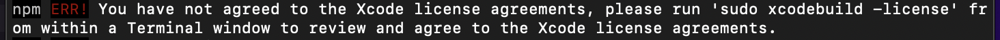

# Jamkit 문제 해결

## (Windows) Android 폰을 PC에 연결할 수 없어요!

일부 Android 폰은 별도의 OEM USB 드라이버를 설치해야 PC에서 인식하고 연결할 수 있습니다. [OEM USB 드라이버 다운로드 목록 페이지](/reference/install-android-oem/)에서 해당되는 제조사의 드라이버를 다운로드하여 설치할 수 있는지 확인해보세요.

## (Windows/macOS) Jamkit CLI 설치 도중 gyp 관련 오류 메시지가 나타나요!

아래 사항을 다시 한 번 확인해주세요.

* 최신 버전의 Python (문서 작성 시점 기준으로 Python 3.10)이 설치되어 있는지 확인해주세요.
* Node.js와 Python이 잘 연결되어있는지 확인해주세요. 자세한 방법은 [이 문서](/getting-started/install-windows)를 확인해주세요.

## (macOS) Xcode 라이선스 관련 오류 메시지가 나타나요!

<figure markdown>
  { width=640em }
</figure>

만약 위의 그림과 같이 Xcode 라이선스 관련 오류 메시지가 나타난다면, 다음의 명령어를 수행합니다.

```zsh
sudo xcodebuild -license
```
