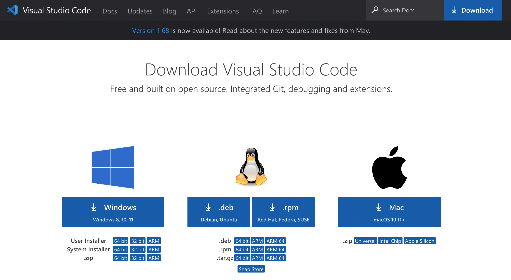

# Jamkit IDE 환경 설정

### Android Studio

#### Android Studio 설치하기

#### 아래의 다운로드 페이지에서 OS에 맞는 Android Studio 최신 버전을 설치합니다.



#### Android SDK 설치하기

Android SDK Platform-Tools를 설치합니다.

* 위치: Tools > SDK Manager > SDK Tools

#### 환경변수 설정하기

Windows

* 위치: "내 컴퓨터" 마우스 우클릭 > 속성> 고급 시스템 설정 > 환경변수 > 시스템 변수 > PATH > 새로 만들기
* 환경변수 입력
  * C:₩Users₩<mark style="color:red;">{사용자명}</mark>₩AppData₩Local₩Android₩Sdk₩Platform-tools

macOS

* 터미널을 실행하고 vi 편집기를 엽니다.
  * bash: vi \~/.bash\_profile
  * zsh: vi \~/.zshrc
* 환경변수를 입력합니다.
  * A키를 눌러 Insert 모드 진입
  * 환경변수 입력: export PATH=$PATH:<mark style="color:red;">{SDK경로}</mark>/platform-tools/
    * <mark style="color:red;">{SDK 경로}</mark>는 "Android Studio > Tools > SDK Manager > Android SDK Location"에서 확인
    * 대부분 "/Users/<mark style="color:green;">{사용자명}</mark>/Library/Android/sdk"로 되어 있음
  * ESC키를 눌러 Insert 모드 종료
  * :wq 입력 후 Enter
* 터미널을 종료 후 재실행하거나 아래 명령어로 환경변수를 적용합니다.
  * source \~/.zshrc

### Visual Studio Code

#### Visual Studio Code 설치

#### 아래의 다운로드 페이지에서 OS에 맞는 Visual Studio Code 최신 버전을 설치합니다.



#### Visual Studio Code 전용 플러그인 설치

Syntax Highlight를 위한 확장파일을 설치합니다.

* jamkit.vsix 파일 다운로드



* "확장(Ctrl + Shift + X / Command + Shift + X) > ... > VSIX에서 설치"를 선택하여 설치
