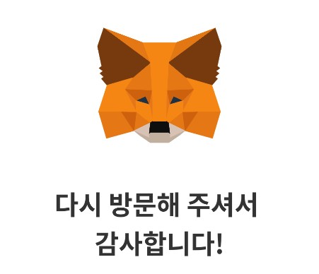

# 실습하기

### 아래의 화면을 구현해보세요


### 실습 가이드

#### 개요

* 위 화면은 순서대로 이미지, 텍스트, 라벨, 텍스트필드, 라벨, 체크박스, 버튼, 텍스트, 버튼으로 구성되어 있습니다.
* 섹션 속성은 [basic-style.md](../../reference/basic-style.md "mention") 또는 [이 문서](https://bookjam.github.io/jamkit/refs\_styles/)를 참고하세요.
* 오브젝트 속성은 [basic-object.md](../../reference/basic-object.md "mention") 또는 [이 문서](https://bookjam.github.io/jamkit/refs\_objects/)를 참고하세요.
* jamkit으로 "practice" 프로젝트를 생성하고, cataog\_home.sbml과 sbss의 본문을 지우고 작업하세요.
* 필요한 이미지는 [이 파일](https://bpmgbiz.sharepoint.com/:u:/s/BPMG\_Lecture/ERTA2vt4vXJBjKH8\_GhYN-IBfIiZ-hNyM4lM2XsMnG2v\_A?e=ii1RT6)을 다운로드하세요.
* 디바이스나 emulator를 실행하여 직접 화면을 보면서 작업하세요.
* 좌우의 여백은 30dp입니다.
* label, textfield, button 등의 오브젝트는 width, height 둘 다 반드시 지정해야 구현됩니다.

#### 작업순서

* catalog\_home.sbml
  * image 오브젝트를 구현합니다.
  * '웰컴welcome' 섹션을 만들고 내용을 입력합니다.
  * '비밀번호password' 섹션을 만들고 label, textfield 오브젝트를 구현합니다.
  * '로그인 정보 저장savelogin' 섹션을 만들고 label, checkbox 오브젝트를 구현합니다.
  * '잠금 해제unlock' button 오브젝트를 구현합니다.
  * '지갑 초기화reset' 섹션을 만들고 텍스트 입력, button 오브젝트를 구현합니다.

### 최종 결과 파일

* 이 [폴더](https://bpmgbiz.sharepoint.com/:f:/s/BPMG\_Lecture/Eo\_0brHfVJ5Plsk31LtBujoBNLCHdoaRc0hJfOCHOH1p8w?e=5WhLZy)의 [레이아웃 다루기 Day 1\_실습하기.zip](https://bpmgbiz.sharepoint.com/:u:/s/BPMG\_Lecture/EX6iwgM4lDtHk6qQhDdEQq0BE25FyQr6SbeQ5fChBSmXPQ?e=lrf81Q)을 다운로드해서 확인해보세요.

### 웰컴 섹션 구현



#### sbml

```
=begin catalog
=begin welcome
=object image: filename=MetaMask_Fox.png, style= img_fox
다시 방문해 주셔서 감사합니다.
=end welcome

=end catalog
```

#### sbss

```
if $SCREEN_WIDTH > 4.7
    $_WELCOME_TEXT_SIZE = 1.4
else
    $_WELCOME_TEXT_SIZE = 1.3
end

/catalog: page-background-color=$THEME_COLOR_BACKGROUND, text-color=$THEME_COLOR_TEXT, font-family=$SANS_KR_MEDIUM, font-size=1.4
/catalog/welcome: font-family=$SANS_KR_BOLD, font-size=2, text-align=center, \
         margin="0 80dp 30dp 80dp", line-break-mode=word-wrap

#img_fox: width=0.4pw, margin="80dp 0 20dp 0"
```

#### tip

* 섹션에 스타일을 주기 위해서는 '/'로 시작을 하여야 하며, '/catalog/welcome'과 같이 섹션의 경로로 지정하여야합니다. 동일한 위치의 섹션명은 스타일이 모두 적용됩집니다.
* 특정 스타일을 연결하기 위해서 sbss에서 정의된 '#img\_fox'와 같이 '#'을 붙여야 합니다.
* sbml의 오브젝트 또는 섹션에서 '#img\_fox' 스타일을 적용시키기 위해서 'style=img\_fox'와 같이 스타일을 연결합니다.
* 이미지의 크기는 width 설정을 통해 할 수 있습니다. width 설정 시 height 또한 자동으로 계산니다.

### password 섹션 구현


#### sbml

```
=begin catalog

=begin welcome
 ...
=end welcome

=begin password
=object label: text="비밀번호", style=lb_password
=object textfield: id="password", placeholder="비밀번호", style=tf_password
=end password

=end catalog
```

#### sbss

```
...

/catalog/password: margin="20dp 30dp"

#lb_password: font-size=1.4, font-weight=bold, align=left
#tf_password: width=1pw-30dp*2, height=50dp, content-border-width=1dp, content-border-radius=5dp, \
            content-border-color=#C0C0C0, content-padding="0 10dp", margin="10dp 0", font-size=1.4
```

#### tip

* 오브젝트는 기본적으로 view의 center에 위치하게 됩니다. sbss에서 '#lb\_password'의 'align=left' 설정과 같이 오브젝트 정렬은 align을 통해서 할 수 있습니다.
* 오브젝트\[input, textfield] 중 placeholder 옵션을 사용할 수 있는 것은 textfield입니다.
* textfield의 경우 width와 height 모두 값을 주어야 합니다.
* 오브젝트의 border, backgroud-color, padding을 줄 경우 'content-'를 반드시 붙여야합니다.
* 'content-border-color'를 적용할 경우에는 'content-border-width'를 함께 적용시켜야 합니다.

### saveLogin 섹션 구현(방법1\~3)


* 양쪽 정렬 구현하는 섹션입니다.
* 이미지와 같이 양쪽으로 정렬하기 위한 방법 3가지에 대하여 설명합니다.
* 3가지 방법 모두 상위 섹션인 saveLogin에서 하위 섹션인 left, right 섹션을 이용하는 것입니다.
* 각 방법의 차이점은 섹션 내 사용는 오브젝트 정의 차이입니다.
* sbss의 경우 공통으로 사용되는 것만 기재하였으며, 방법별로 다른 style 적용은 section 혹은 object에 인라인으로 부여하였습니다.
* 각 방법의 자세한 설명은 tip에 기재되어 있습니다.

### 방법1: right 섹션 오브젝트

#### sbml

```
=begin catalog
...
=begin savelogin

=begin left
로그인정보저장
=end left

=begin right: margin-top=-1em
=object checkbox: image="btn_switch_off.png", selected-image="btn_switch_on.png", style=cb_savelogin, align=right
=end right

=end savelogin
...
=end catalog
```

#### sbss

```
...

/catalog/savelogin: margin="20dp 30dp"

#cb_savelogin: height=35dp, vertical-align=middle
```

#### tip

* 하위 섹션중 right 섹션에서만 object를 사용합니다. 스타일은 right섹션에서 margin-top만 적용되었습니다. 섹션은 default로 width가 1pw이기에 하위 라인에 정의한 right 섹션을 'margin-top=-1em'을 적용시켜 left 섹션에 겹쳐지게 하여 정렬되도록하는 방법입니다.
* 주의점은 left 섹션에서는 오브젝트 사용 없이 텍스트가 들어갔기 때문에, right 섹션에 'background-color'를 적용시키게 될 경우 텍스트가 보이지 않습니다. 또한 'align=right'를 오브젝트에 적용시켜야 합니다.

### 방법2: right 섹션 인라인 오브젝트

#### sbml

```
=begin catalog
...
=begin savelogin

=begin left
로그인정보저장
=end left

=begin right: margin-top=-1em, text-align=right
=(object checkbox: image="btn_switch_off.png", selected-image="btn_switch_on.png", style=cb_savelogin)=
=end right

=end savelogin
...
=end catalog
```

#### sbss

```
...

/catalog/savelogin: margin="20dp 30dp"

#cb_savelogin: height=35dp, vertical-align=middle
```

#### tip

* 방법1과 다르게 오브젝트 checkbox를 인라인 오브젝트로 정의한 방법입니다.
* 차이점은 style 적용입니다. 방법1에서는 오브젝트에 'align=right'를 적용시켰지만, 방법2에서는 right 섹션에 text-align=right를 적용시킵니다.

### 방법3: 각 세션 내 오브젝트 적용

#### sbml

```
=begin catalog
...
=begin savelogin

=begin left
=object label: text='로그인정보저장', font-size=1.4, font-weight=bold, align=left
=end left

=begin right: margin-top=-1em
=object checkbox: image="btn_switch_off.png", selected-image="btn_switch_on.png", style=cb_savelogin, align=right
=end right

=end savelogin
...
=end catalog
```

#### sbss

```
...

/catalog/savelogin: margin="20dp 30dp"

#cb_savelogin: height=35dp, vertical-align=middle
```

#### tip

* 하위 섹션 모두에 오브젝트를 정의한 방법입니다. 각 오브젝트에서 align을 사용하지 않을 각 하위 섹션에 적용된 스타일은 방법1과 마찬가지로 'margin-top=-1em'이며, 각 object에 align 스타일을 적용시키지 않을 경우, 오브젝트 label과 오브젝트 checkbox가 겹치는 것을 확인할 수 있습니다.

### 잠금 해제 버튼 구현

* 잠금 해제 버튼은 특정 섹션 내에서 구현하지 않습니다.


#### sbml

```
=begin catalog

=begin welcome
 ...
=end welcome

=begin password
...
=end password

=begin saveLogin
...
=end saveLogin

=object button: label="잠금 해제", style=btn_unlock

=end catalog
```

#### sbss

```
...
#btn_unlock: label-font-size=1.5, label-font-weight=bold, label-color=#FFF,
            content-background-color=#1E90FF, width=1pw-60dp, height=60dp, content-border-radius=30dp, margin="40dp 0"
```

#### tip

* 오브젝트 button에서 label을 적용한 경우 label의 크기만큼 button의 크기가 맞춰집니다. 따라서 width와 height를 설정해야합니다.

### reset 섹션 구현


#### sbml

```
=begin catalog

=begin welcome
...
=end welcome

=begin password
...
=end password

=begin saveLogin
...
=end saveLogin

...

=begin reset
지갑의 잠금이 해제되지 않나요? 현재 지갑을 삭제한 후 새 지갑을 생성할 수 있습니다.
=object button: label="지갑 초기화", style=btn_reset
=end reset

=end catalog
```

#### sbss

```
...

/catalog/reset: margin="10dp 70dp", text-align=center, line-break-mode=word-wrap

#btn_reset: label-font-size=1.5, label-color=#1E90FF, \
            margin="20dp 0", width=1pw-60dp, height=30dp
```

#### tip

* reset 섹션 내의 text-align은 left가 기본값입니다. 따라서 center로 적용시켜야합니다.
* 버튼 내에서 label의 크기, 색상을 변경하기 위해서는 prefix로 'label-'이 필요합니다. 자세한 스타일 적용 항목은 참조문서의 기본 오브젝트를 확인해주세요.
