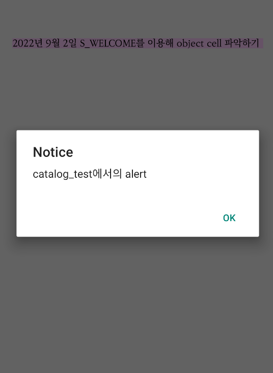

# 레이아웃 다루기 Day 2

### Section을 Object처럼 처리하기


```javascript
// SBML
=begin test
섹션 내용
=end test

// SBSS
/test: display=block, position=absolute, gravity=center, \
        x=100dp, y=30, pack=yes, background-color=#FFCC
```


* object는 기본적으로 block 처리가 되어 있지만, section은 그렇지 않다. object과 같이 block 처리를 해주기 위해서는 `display=block`을 적용하면 된다.
* 또한 section은 width의 기본 값이 1pw이기에, section 내의 텍스트가 차지하는 영역의 크기에 맞추기 위해서 `pack=yes` 속성을 적용할 수 있다. (padding 영역을 포함)
* `position=absolute`를 적용할 때, `gravity`나 `x,y` 속성을 통해서 section의 위치를 화면 내에서 자유롭게 배치할 수 있다.

### Section 숨기기


```javascript
=begin test: display=none
섹션 내용
=end test
```


* section에 `display=none` 스타일을 적용하면, 해당 섹션의 width, height를 포함해 보이지 않게 된다.

### Object 숨기기


```javascript
// 방법 1: hidden=yes
=object image: filename="check.png", width=50dp, hidden=yes

// 방법 2: alpha=0

=object image: filename="check.png", width=50dp, alpha=0

// 방법 3: display=none
=object image: filename="check.png", width=50dp, display=none
```


* hidden=yes\
  ⇒ 오브젝트가 화면에서 보이지 않지만 width와 height가 그대로 남아 있다.
* alpha=0\
  ⇒ 투명도를 조절하는 스타일 속성으로, 오브젝트가 화면에서 보이지 않지만 width와 height가 그대로 남아 있다.
* display=none\
  ⇒ 오브젝트가 화면에서 보이지 않으며, width와 height까지 없어진다.

### 화면 내 독립적인 레이아웃을 불러오는 방법


```javascript
// 방법 1: object sbml
=object sbml: filename={filename.sbml}

// 방법 2: object section
=object section: section={id}

// 방법 3: object cell (container object)
=object cell: display-unit={id}
```


* object sbml, object section은 레이아웃(sbml, sbss)만 올릴 수 있다.
  * 
* object cell은 레이아웃뿐만 아니라 스크립트(js)도 올릴 수 있다.
  * `display-unit`은 독립적인 sbml/sbss/js를 연결시켜주는 고리이며, 해당 속성을 사용하기 위해서는 파일의 이름 규칙을 알아야 한다.
  * 

### Object Cell


```javascript
=begin catalog
=begin body


=object cell: display-unit="S_WELCOME", width=0.5pw, height=0.5ph

=end body

=end catalog
```


* `object cell`을 불러오기 위해서는 `display-unit`을 사용해야 한다.
* `display_unit`에 파일의 이름을 연결하는 것으로, `object cell`을 사용하기 위해서는 반드시 `ABC_cell.sbml` `ABC_cell.sbss`와 같이 파일명이 `{display-unit}_cell`로 정의되어야 한다.
* 또한 반드시 `width`와 `height` 속성을 주어야 한다.
* 

### Object Cell 구현 예시

* 예시 1: 확인을 위해 blank로 화면 채움


```javascript
=begin cell

=object blank: width=1pw, height=1ph, background-color=#FFCCFF
=end cell
```


* 예시 2: `${__DATA__}`을 섹션 내에 입력할 경우 `S_WELCOME_cell`의 환경 설정 내용이 나온다.


```javascript
=begin cell: background-color=#FFCCFF
${__DATA__}
=end cell
```



* 예시 3: `${__DATA__}`의 데이터를 가져오는 방법은 `${변수명}`을 사용함

```javascript
=begin cell: background-color=#FFCCFF
${YEAR}년 ${MONTH}월 ${DAY}일 ${id}를 이용해 object cell 파악하기
=end cell
```


### Object Cell에 JS를 적용한 독립적인 레이아웃

* S\_WELCOME\_cell.js 파일 만들기
* `on_load` 함수 만들기 ⇒ `controller.action의 alert`로, 독립적인 context 적용을 확인하는 용도
* S\_WELCOME\_cell.sbml에 script 연결
* 

#### S\_WELCOME\_cell.js


```javascript
function on_load() {
    controller.action("alert", {"message": "catalog_test에서의 alert"})
    }
```


#### S\_WELCOME\_cell.sbml

* `script-when-loaded`는 화면이 올라올때 script가 작동되는 것(jquery의 `document.ready` 유사)


```javascript
=begin cell: background-color=#FFCCFF, script-when-loaded=on_load
${YEAR}년 ${MONTH}월 ${DAY}일 ${id}를 이용해 object cell 파악하기
=end cell
```


#### 화면 실행결과: 두 개의 alert이 뜸




