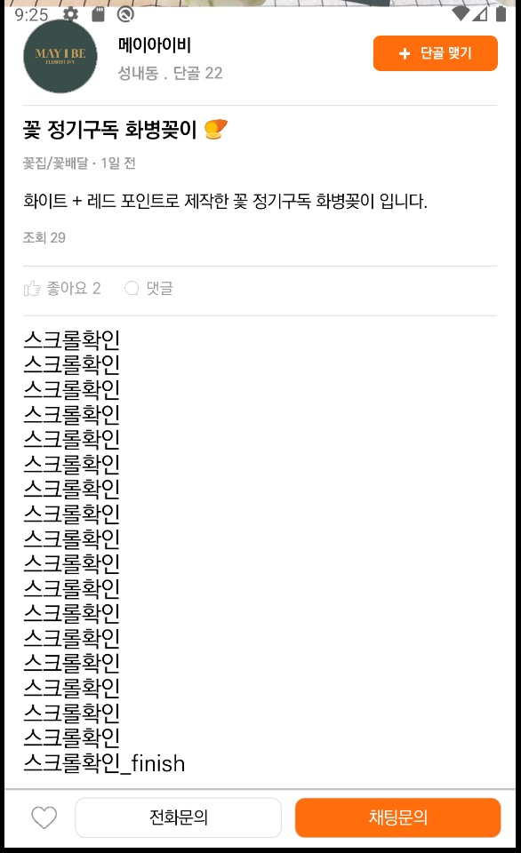

# 실습하기

### 아래의 화면을 구현해보세요

<figure><figcaption></figcaption></figure>

### 실습 가이드

#### 개요

* 섹션 속성은 [basic-style.md](../../reference/basic-style.md "mention") 또는 [이 문서](https://bookjam.github.io/jamkit/refs\_styles/)를 참고하세요.
* 오브젝트 속성은 [basic-object.md](../../reference/basic-object.md "mention") 또는 [이 문서](https://bookjam.github.io/jamkit/refs\_objects/)를 참고하세요.
* jamkit으로 "practice" 프로젝트를 생성하고, cataog\_home.sbml과 sbss의 본문을 지우고 작업하세요.
* 필요한 이미지는 [이 파일](https://bpmgbiz.sharepoint.com/:u:/s/BPMG\_Lecture/ERTA2vt4vXJBjKH8\_GhYN-IBfIiZ-hNyM4lM2XsMnG2v\_A?e=ii1RT6)을 다운로드하세요.
* 디바이스나 emulator를 실행하여 직접 화면을 보면서 작업하세요.
* label, textfield, button 등의 오브젝트는 width, height 둘 다 반드시 지정해야 구현됩니다.

#### **작업 순서**


catalog\_home.sbml에서 catalog 섹션 내에서 아래의 섹션들을 구현합니다.


* catalog\_home.sbml
  * \[판매상품이미지]**top 섹션**을 만들고 image, button 오브젝트를 구현합니다.
  * \[판매자]**seller 섹션**을 만들고 image, label, button 오브젝트를 구현합니다.
  * \[판매상품소개] **product 섹션**을 만들고 label, blank 오브젝트를 구현합니다.
  * \[좋아요/댓글]**communicate 섹션**을 만들고 label과 button 오브젝트를 구현합니다.
  * 위의 섹션들을 **object section**과 연결합니다.
  * \[문의]**object cell**을 구현합니다.
* S\__INQUIRE\_cell.sbml_
  * \[하트]**right 섹션**을 만들고, checkbox 오브젝트를 구현합니다.
  * \[문의]**left 섹션**을 만들고, button 오브젝트를 구현합니다.

### 최종 결과 파일

* 이 [폴더](https://bpmgbiz.sharepoint.com/:f:/s/BPMG\_Lecture/Ev8bHqTIvM1JgRIu\_t1RsNcBY0vVGnrlxil9jkBu\_Pg\_KQ?e=Gw7D52)의 [레이아웃 다루기 Day 2\_실습하기.zip](https://bpmgbiz.sharepoint.com/:u:/s/BPMG\_Lecture/EWC3CZZ\_cPhBht2lQHGIXUsBvu4tD5iYSabnkXLPlAaQrg?e=EPajyG)을 다운로드해서 확인해보세요.

### 구현 가이드


레이아웃 다루기 Day 2의 내용에 중점을 맞춰 tip 내용이 기재되어 있습니다.


* **catalog\_home.sbml**

<details>

<summary>top 섹션 구현</summary>

&#x20;                                       

#### sbml

```
// top section

=comment: 이미지, 버튼들
=begin top
=object image: filename="mayibe.jpg", style=img_product
=object button: image="icon_close_w.png", style=btn_close
=object button: image="icon_share_w.png", style=btn_share
=object button: image="icon_more_vertical_w.png", style=btn_more
=end top
```

#### sbss

```
// top sbss

/catalog/top:display=block, positon=abs, gravity=top, margin-top=22dp

#img_product: width=1pw, height=0.9pw, scale-mode=fill
#btn_close: width=25dp, position=abs, x=10dp, y=5dp
#btn_share: width=25dp, position=abs, gravity=right-top, x=-50dp, y=5dp
#btn_more: width=25dp, position=abs, gravity=right-top, x=-10dp, y=5dp
```

#### tip

* 나중에 정의 오브젝트로 덮어 씌어지기 때문에, button들이 img 오브젝트 위에 있습니다.
* top.right섹션에서의 버튼들이 인라인오브젝트 버튼들의 간격을 띄우기 위해선 margin-right 혹은 margin-left를 적용합니다

</details>

<details>

<summary>seller 섹션 구현</summary>

#### &#x20;                                            

#### sbml

```
// seller sbml

=begin seller
=begin seller.left
=object button: image="icon_profile.jpg", style=img_seller
=end seller.left

=begin seller.center
=object label: text="메이아이비", style=lb_seller_name
=object label: text="성내동 . 단골 22", style=lb_seller_detail
=end seller.center

=begin seller.right
=(object image: filename="plus.png", style=img_seller_plus)=\
=(object button: label="단골 맺기", style=btn_seller_plus)=
=end seller.right
=end seller
```

#### sbss

```
// seller sbss

--seller
/catalog/seller:  display=block, height=70dp, border-bottom-width=1dp, border-bottom-color=#D3CFCFAB, margin="10dp 15dp"
/catalog/seller/seller.left: display=block, position=abs, width=80dp
/catalog/seller/seller.center: display=block, position=abs, width=200dp, height=60dp, x=200, y=35
/catalog/seller/seller.right:  display=block, position=abs, width=100dp, x=1pw-340, y=35, \
                            padding="8dp 0", background-color=#FF6D0C, border-radius=15%, text-align=center
    
#img_seller: width=60dp, height=60dp, align=left, content-border-radius=100%, content-border-width=1dp, content-border-color=#777575AB
#lb_seller_name: font-weight=bold, align=left
#lb_seller_detail: text-color=#6B6969AB, font="bold 0.9 sans-serif", margin-top=8dp, align=left

#img_seller_plus: width=9dp, margin-right=8dp, vertical-align=middle
#btn_seller_plus: label-font-size=0.8, font-weight=bold, label-color=#FFFFF, vertical-align=middle


```

#### tip

* seller.right섹션의 경우 아이콘과 버튼을 함께 정렬해야 하기에, 섹션 전체를 버튼처럼 보이게 처리합니다.

</details>

<details>

<summary>product 섹션 구현</summary>

&#x20;                                               

#### sbml

```
// product sbml

=comment: 판매상품 상세
=begin product
=object label: text="꽃 정기구독 화병꽂이 🍠", style=lb_product_title
=(object label: text="꽃집/꽃배달",style=common_product)= \
=(object blank: style=blk_product)= \
=(object label: text="1일 전", style=common_product)= 

화이트 + 레드 포인트로 제작한 꽃 정기구독 화병꽂이 입니다.
\n
=object label: text="조회 29", style=lb_product_lookup
\n
=end product
```


#### sbss

```
// product sbss

--product
/catalog/product: border-bottom-width=1dp, border-bottom-color=#D3CFCFAB, margin="10dp 15dp"

#common_product: text-color=#6B6969AB, vertical-align=middle, font-size=0.8, font-weight=bold, align=left
#lb_product_title: style=common_product, margin="10dp 0", font-size=1.2, text-color=#000000
#blk_product: content-background-color=#6B6969AB, width=2dp, height=2dp, vertical-align=middle
#lb_product_lookup: font-size=0.8, font-weight=bold, align=left, text-color=#6B6969AB

```

</details>

<details>

<summary>communicate 섹션 구현</summary>

#### &#x20;                                              

#### sbml

```
// communicate sbml

=comment: 좋아요, 댓글
=begin communicate
=begin communicate.like
=(object button: image="like.png", width=15dp)= \
=(object label: text="좋아요 2", style=communicate.btn)=
=end communicate.like

=begin communicate.comment
=(object button: image="chat.png", width=15dp)= \
=(object label: text="댓글", style=communicate.btn)=
=end communicate.comment
=end communicate
```

#### sbss

```
// communicate sbss

--communicate
/catalog/communicate: display=block, height=30dp, border-bottom-width=1dp, border-bottom-color=#D3CFCFAB, margin="10dp 15dp"
/catalog/communicate/communicate.like: display=block, position=abs, width=70dp
/catalog/communicate/communicate.comment: display=block, position=abs, width=50dp, x=80dp

#communicate.btn: font-size=0.9, text-color=#6B6969AB
```

#### tip

* communicate 섹션을 display=block 하지 않을 경우, 하위 섹션인 like과 comment가 position=abs에 의해 communicate 섹션의 영역 범위를 벗어납니다.
* communicate 섹션을 display=block 하였어도 하위 섹션인 like, comment에 현재 스타일 gravity를 추가할 경우 communicate 섹션의 영역 범위를 벗어납니다.

</details>

<details>

<summary>object section 연결</summary>

object section 연결 이유는&#x20;

bottom에 고정되어 있는 object cell의 위치를 제외한 영역에서&#x20;

스크롤이 적용되도록 하기 위해서 입니다.

#### sbml

```
// object section

=object section: section=section.view, width=1pw, height=0.93ph

=begin catalog: id=section.view, display=none
=begin top
...
=end top

=begin seller
...
=end seller

=begin product
...
=end product

=begin communicate
...
=end communicate
=end catalog
```

#### tip

* catalog section id와 object section의 section이 일치해야 합니다.
* object section의 width는 전체 너비여야 하기에 1pw으로 해야 합니다.
* object section의 height는 object cell가 들어갈 높이를 고려해야 하기에, 1ph가 아닙니다.

</details>


* **S\_**_**INQUIRE\_cell**_

<details>

<summary>left, right 섹션 구현</summary>

#### sbml

```
=begin cell

=begin left
=object checkbox: id="heart", style=chk_heart
=end left
=begin right
=(object button: label="전화문의", script=on_click_tel, style=btn_phone)=\
=(object button: label="채팅문의", script=on_click_chat, style=btn_chat)=
=end right

=end cell
```

#### sbss

```
/cell: border-top-width=2dp, border-top-color=#A8A6A6AB
/cell/left: display=block, position=abs, width=0.1pw, gravity=left, x=30
/cell/right: display=block, position=abs, width=0.9pw, gravity=right,  x=-30, text-align=right


#common.style:  width=45%, height=0.08pw, content-border-width=1dp, content-border-radius=8dp, content-border-color=#D3CFCFAB
#btn_phone: style=common.style, margin="0 10dp"
#btn_chat: style=common.style, content-background-color=#FF6D0, label-color=#FFFFFF, content-background-color=#FF6D0C
#chk_heart: image="heart_gray.png", width=0.05pw, selected-image="heart_red.png"
```

#### js

```javascript
function on_click_tel() {
     controller.action("alert", {"message": "전화 문의 팝업"})
}

function on_click_chat() {
     controller.action("alert", {"message": "채팅 문의 팝업"})
}

```

</details>

* **object cell**&#x20;

<details>

<summary>object cell 구현</summary>

&#x20;                                           

catalog\_home.sbml에서 object cell로&#x20;

**S\_**_**INQUIRE\_cell의**_ JS(context)가 적용되어지는 독립적인 layout을 구현합니다.

#### sbml

```

=object section: section=sell_detail, width=1pw, height=0.93ph
=object cell: display-unit="S_INQUIRE", \
width=1pw, height=0.07ph, position=abs, gravity="bottom"

=begin catalog: id=sell_detail, display=none
...
=end catalog

```

#### tip

* object cell은 파일이름 규칙에 따라 파일의 끝명이 '\_cell'의 파일들을 탐색합니다.
* 따라서 display-unit에 S\_INQUIRE\_cell.\* 의 'S\_INQUIRE'로 연결합니다.
* object cell의 width는 object section과 마찬가지로 1pw이며, height는 object section의 높이를 제외하여 0.07ph 입니다.
* object cell을 화면의 하단에 고정시켜야 하므로, position=abs, gravity=bottom을 적용시킵니다.


</details>
